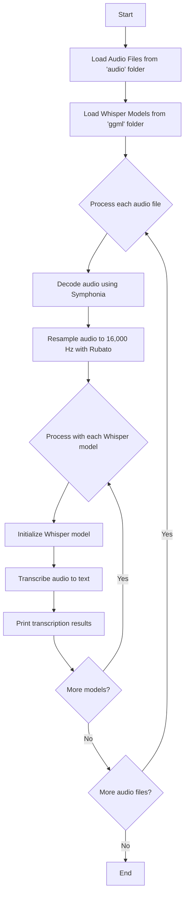

# Speech to Text

This project is built with Rust-based [Whisper](https://github.com/tazz4843/whisper-rs) crate, which converts audio
files to text using [Whisper speech recognition model](https://huggingface.co/ggerganov/whisper.cpp/tree/main)

## Feature

- **Multiple Audio Formats**: Supports `MP3` and `WAV` through the [Symphonia](https://github.com/pdeljanov/Symphonia)
  crate
- **Audio Processing**: Resamples audio files with [Rubato](https://github.com/HEnquist/rubato)
- **Batch Processing**: Handles multiple audio files with each Whisper models

## Prerequisites

- Whisper Models: Download from [Hugging Face](https://huggingface.co/ggerganov/whisper.cpp/tree/main) and place in
  `ggml` folder
- Audio Files: Place MP3 or WAV files in `audio` folder

## GPU Acceleration (CUDA):

If your device supports `CUDA`, enable GPU acceleration by adding the CUDA feature to your dependencies:

```toml
whisper-rs = { version = "0.14.2", features = ["cuda"] }
```

## Flow Chart


