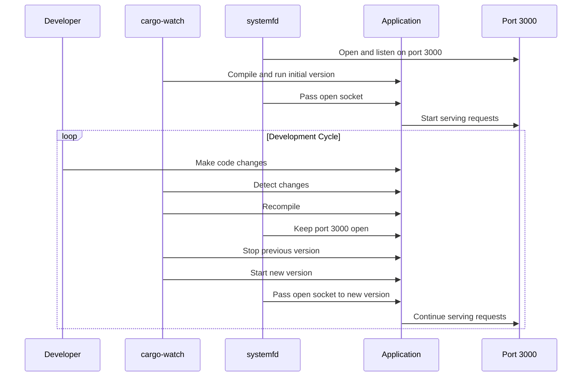

# auto-reload

This examples shows how you can set up a development environment for your axum
service such that whenever the source code changes, the app is recompiled and
restarted. It uses `listenfd` to be able to migrate connections from and old
version of the app to a newly-compiled version.

## Setup

```sh
cargo install cargo-watch systemfd
```

## Running

```sh
systemfd --no-pid -s http::3000 -- cargo watch -x run
```


