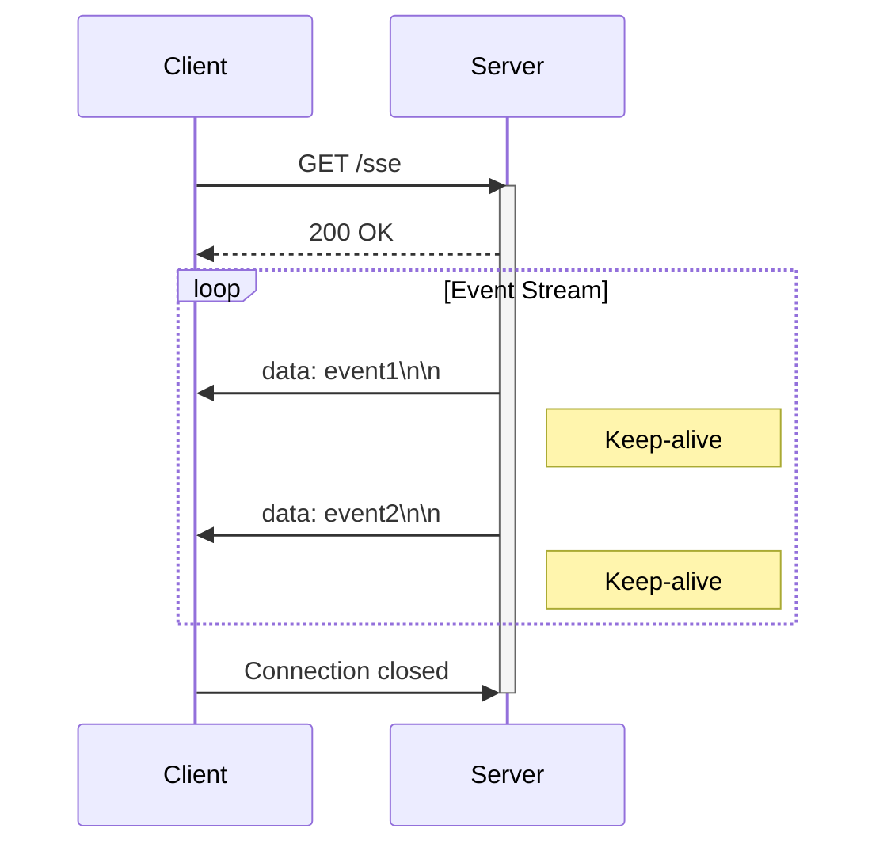

# SSE (Server-Sent Events)

```mermaid
sequenceDiagram
    participant Client
    participant Server

    Client->>Server: GET /sse

    activate Server
    Server-->>Client: 200 OK

    loop Event Stream
        Server->>Client: data: event1\n\n
        Note right of Server: Keep-alive
        Server->>Client: data: event2\n\n
        Note right of Server: Keep-alive
    end

    Client->>Server: Connection closed
    deactivate Server
```

Server-Sent Events is a web technology that enables real-time, unidirectional
data streaming fomr servers to clients over a single HTTP connection
